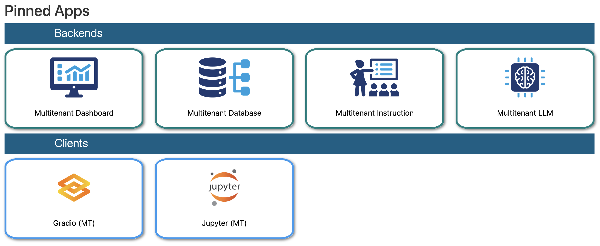
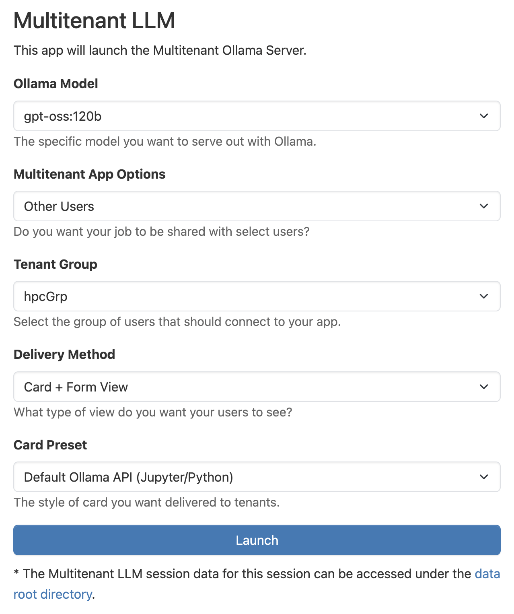
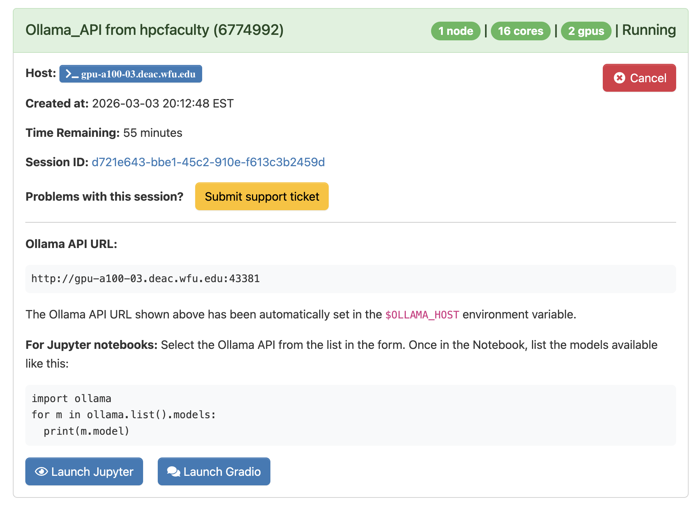

# Multitenant Apps: LLMs, Databases, Dashboards, and other shared services within Open OnDemand
[](https://doi.org/10.5281/zenodo.18500730)

**Wake Forest University**<br>
**The HPC Team** (https://hpc.wfu.edu)<br>
**Principal contact: Sean Anderson** (anderss@wfu.edu)
**The Multitenant Apps framework is proud to be a part of the [Open OnDemand Appverse](https://openondemand.connectci.org/appverse)!**

[GOOD26 Presentation from Mar. 11, 2026](https://github.com/WFU-HPC/OOD-MultitenantApps/blob/main/pres-good26.pdf)<br>
[Video Recording of the main presentation with demos](https://vimeo.com/showcase/12164326?video=1174785059)<br>
[Video Recording of the classroom presentation with demo](https://vimeo.com/showcase/12164326?video=1174777047#t=40m50s)

[Tips and Tricks Presentation from Oct. 2, 2025](https://github.com/WFU-HPC/OOD-MultitenantApps/blob/main/pres-tipsandtricks.pdf)<br>
[Video Recording of the Presentation with Demos](https://drive.google.com/file/d/1aHcIRVxz4xpamuEcX_12sOG7OCYVNlBe/view?usp=sharing)

## Overview

The Multitenant Apps framework was developed for supporting LLMs, databases, and other services on traditional, job-based HPC infrastructure through Open OnDemand (OOD). It allows for controlled and secure sharing of these services between select users, and can greatly reduce hardware overhead since users share the same resources. It is also an effective method for delivering content to users within the OOD interface, which is especially useful within classrooms, research groups, and even departments.

- **Type:** OOD framework (multiple Batch Connect apps)
- **Components:** Client apps, Service apps, Delivery apps, Dashboard initializer
- **Scheduler:** Slurm (with optional WCKey enforcement)
- **Access control:** POSIX groups and/or Slurm WCKeys
- **Cluster:** DEAC (designed to be portable)

## Screenshots



<table>
  <tr>
    <td></td>
    <td></td>
  </tr>
</table>

## Features

- Framework for running shared LLMs, databases, dashboards, and other
  services on HPC clusters through Open OnDemand
- Three app types: 
    - **Services** (launch and manage shared resources)
    - **Delivery** (push content to users)
    - **Clients** (connect to running services)
- Controlled sharing between select users via POSIX groups and Slurm WCKeys
- Reduced hardware overhead -- multiple users share the same running service

## Requirements

### OOD Server

- Tested with OOD v4.0+ and v3.1.*

### Slurm

- Any recent Slurm version
- Slurm with accounting enabled
- Slurm WCKey support (optional, for access control enforcement)

### Access Control

- POSIX group (e.g., `mtUsr`) for restricting access to apps
  (recommended)

## Disclaimer

This software comes with no warranty. Make sure to use your "development" OOD server for testing, and make backups of any config or installation files as needed. For the Slurm WCKeys, you should test first without making any changes to your Slurm config files.

## Installation

I will assume that you have cloned the repo on your OOD dev server, and are working out of the root of this directory. You will need Root privileges for most of these commands, so take appropriate measures beforehand.

To get started, add this variable to your `/etc/ood/config/apps/dashboard/env` file:

```sh
MULTITENANT_ENABLE=false
```

Anything other than `true` will bypass the initializer, so this is just for safety while we put everything in place.

Copy the initializer to the correct location:

```sh
cp ./initializer/multitenant.rb /etc/ood/config/apps/dashboard/initializers/multitenant.rb
```

Now you need to copy all of the apps to the OOD system apps directory. If you are going to use a POSIX group to restrict their access, you will need to put the correct ownership and permissions now. In this example, I will use the `mtUsr` POSIX group as the group owner:

```sh
# copy
## Clients
cp -r ./apps-clients/multitenant-gradio              /var/www/ood/apps/sys/multitenant-gradio
cp -r ./apps-clients/multitenant-jupyter             /var/www/ood/apps/sys/multitenant-jupyter
## Delivery
cp -r ./apps-delivery/multitenant-delivery_debug     /var/www/ood/apps/sys/multitenant-delivery_debug
cp -r ./apps-delivery/multitenant-delivery_default   /var/www/ood/apps/sys/multitenant-delivery_default
cp -r ./apps-delivery/multitenant-delivery_readfile  /var/www/ood/apps/sys/multitenant-delivery_readfile
## Services
cp -r ./apps-services/multitenant-dashboard          /var/www/ood/apps/sys/multitenant-dashboard
cp -r ./apps-services/multitenant-database           /var/www/ood/apps/sys/multitenant-database
cp -r ./apps-services/multitenant-instruction        /var/www/ood/apps/sys/multitenant-instruction
cp -r ./apps-services/multitenant-llm                /var/www/ood/apps/sys/multitenant-llm

# ownership
## Clients
chown -R root:mtUsr /var/www/ood/apps/sys/multitenant-gradio
chown -R root:mtUsr /var/www/ood/apps/sys/multitenant-jupyter
## Delivery
chown -R root:mtUsr /var/www/ood/apps/sys/multitenant-delivery_debug
chown -R root:mtUsr /var/www/ood/apps/sys/multitenant-delivery_default
chown -R root:mtUsr /var/www/ood/apps/sys/multitenant-delivery_readfile
## Services
chown -R root:mtUsr /var/www/ood/apps/sys/multitenant-dashboard
chown -R root:mtUsr /var/www/ood/apps/sys/multitenant-database
chown -R root:mtUsr /var/www/ood/apps/sys/multitenant-instruction
chown -R root:mtUsr /var/www/ood/apps/sys/multitenant-llm

# permissions
## Clients
chmod 755 /var/www/ood/apps/sys/multitenant-gradio
chmod 755 /var/www/ood/apps/sys/multitenant-jupyter
## Delivery
chmod 755 /var/www/ood/apps/sys/multitenant-delivery_debug
chmod 755 /var/www/ood/apps/sys/multitenant-delivery_default
chmod 755 /var/www/ood/apps/sys/multitenant-delivery_readfile
## Services
chmod 750 /var/www/ood/apps/sys/multitenant-dashboard
chmod 750 /var/www/ood/apps/sys/multitenant-database
chmod 750 /var/www/ood/apps/sys/multitenant-instruction
chmod 750 /var/www/ood/apps/sys/multitenant-llm
```

Make sure that everything looks good on both the filesystem and in your OOD dashboard. Only users in the `mtUsr` group should be able to see the four "service" apps in their dashboard.


## Slurm WCKeys (IMPORTANT!)

We use `multitenant` for the WCKey. This value is arbitrary and you can use whatever you want! Just make sure to change it in both the initializer and in the `submit.yml.erb` files of the Multitenant apps (services).

This guide assumes that you do not currently have WCKeys enabled or used on your HPC system. If you are already using them -- you don't need any help from me!

The [documentation on the WCKeys is sparse](https://slurm.schedmd.com/wckey.html), to say the least. All you need to know is that we use WCKeys as both a way to:

1. **FILTER** the Multitenant jobs out of the queue, and also as a 
2. **SECURITY MEASURE** to restrict which users can even submit Multitenant jobs.

If you do not want to use them like point #2 above, then you do not need to modify your Slurm configuration at all. You can still submit jobs with an associated WCKey and Slurm will let you use all of the other commands to view those jobs.

If you do want to use them like point #2 above, then continue reading below.


### Enforcing WCKeys

You will need to add this to your `slurm.conf` file:

```
AccountingStorageEnforce=...,wckeys
TrackWCKey=yes
```

Note that you add `wckeys` to whatever values are already present in `AccountingStorageEnforce`. Next, add this to your `slurmdbd.conf` file:

```
TrackWCKey=yes
```

**WARNING:** Once those files have been edited, you will need to stop the `slurmctld` and `slurmdbd` services on your Slurm controller, and then start them again while monitoring their status and behavior. Once you confirm that everything is working as expected, you may have to restart `slurmd` on the rest of the cluster so that the new config can go into effect everywhere.


### Managing WCKeys

Get a list of all WCKeys currently in Slurm:

```sh
sacctmgr list wckey
```

Every **existing** user (that has submitted a job before) that submits a job without setting a WCKey gets two entries, one blank and one `*`.

You do not need to create WCKeys beforehand. Adding users to a WCKey will create it automatically, and removing all users from a WCKey will remove it from the list of active values. These tasks are easy to do, and take effect immediately:

```sh
sacctmgr add user hpcfaculty wckey=multitenant # to add a user to the multitenant wckey

sacctmgr del user hpcfaculty wckey=multitenant # to remove a user to the multitenant wckey
```

**WARNING:** new users, or users who have never submitted before, will **NOT** have any WCKey value associated with them. You will need to add them to a WCKey and give them a default:

```sh
sacctmgr add user <newuser> wckey=""
sacctmgr mod user <newuser> set defaultwckey=""
```

You can add these commands to your onboarding process.

## Enabling the Multitenant Framework

Once you have everything in place and are satisfied with your Slurm configuration, you will need to enable the Multitenant framework by chaning the environment variable in the `/etc/ood/config/apps/dashboard/env` file:

```sh
MULTITENANT_ENABLE=true
```

You will need to restart your PUN in order for this change to take effect.

## Testing & Troubleshooting

- You need at least two user accounts to properly test everything out, so grab a buddy or get a new test account!
- Remember, nothing will happen on the receiving user's side until they restart their PUN, so you will be well served to make a new button or link just for that.
- Always start with small groups with only a few members first. Realistically, you'll want to keep your sharing list under 150 to 200 people.

| Site                      | OOD Version   | Scheduler | Status     |
|---------------------------|---------------|-----------|------------|
| Wake Forest University    | 4.2.2         | Slurm     | Production |
| University of Utah CHPC   | ?             | Slurm     | Testing    |

## Known Limitations

- Not for enterprise applications
- Not for high security applications
- Not for sharing Jupyter Notebooks, RStudio or other "log-in" or user-facing applications
- Not for sharing interactive VNC connections (maybe view-only)

## Contributing & Support

Please [open an issue](https://github.com/WFU-HPC/OOD-MultitenantApps/issues) or send an email to start a conversation. We would love to hear your feedback and welcome contributions! To contribute directly:

1. Fork this repository
2. Create a feature branch (`git checkout -b feature/my-improvement`)
3. Submit a pull request with a description of your changes

## References

- [GOOD26 Presentation from Mar. 11, 2026](https://github.com/WFU-HPC/OOD-MultitenantApps/blob/main/pres-good26.pdf)<br>
- [Video Recording of the main presentation with demos](https://vimeo.com/showcase/12164326?video=1174785059)<br>
- [Video Recording of the classroom presentation with demo](https://vimeo.com/showcase/12164326?video=1174777047#t=40m50s)
- [Tips and Tricks Presentation from Oct. 2, 2025](https://github.com/WFU-HPC/OOD-MultitenantApps/blob/main/pres-tipsandtricks.pdf)<br>
- [Video Recording of the Presentation with Demos](https://drive.google.com/file/d/1aHcIRVxz4xpamuEcX_12sOG7OCYVNlBe/view?usp=sharing)
- [Slurm WCKey documentation](https://slurm.schedmd.com/wckey.html)
- [OOD Batch Connect app development docs](https://osc.github.io/ood-documentation/latest/app-development.html)
- [OSC Jupyter App](https://github.com/OSC/bc_osc_jupyter)
- [OSC Jupyter+Ollama App](https://github.com/OSC/bc_osc_jupyter_ollama)
- [Pace Jupyter+Ollama App](https://github.com/pace-gt/bc_ollama_jupyter)
- [Tips and Tricks talk by Ron Rahaman from Georgia Tech's PACE](https://drive.google.com/drive/folders/16vBO3HTWiLxB2vPrVzafXDSmcxT3QBIM)
- [PEARC24 paper on Stable Diffusion in the Classroom](https://dl.acm.org/doi/10.1145/3626203.3670526)

## License

[MIT License](LICENSE)

## Acknowledgments

- Adam Carlson and Cody Stevens (WFU HPC Team)
- Travis Ravert (OSC)
- Ying Zhang & CSC331 class (WFU)
- Jerid Francom (WFU)
